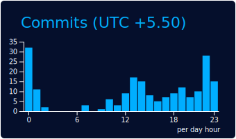

  <a href="https://github.com/aryanb1906">
    <picture>
      <source media="(prefers-color-scheme: dark)" srcset="https://raw.githubusercontent.com/aryanb1906/aryanb1906/main/dark_mode.svg">
      
    </picture>
  </a>

---

## 💫 About Me

<h3 align="center">I love development and competitive programming. Passionate about building high-quality products, solving real problems, and continuously improving in AI/ML and software engineering.</h3>

- 🌱 **Currently learning:** MySQL, Next.js, and React.js
- 👯 **Open to collaboration on:** Frontend development and competitive programming projects
- 📫 **Reach me at:** [aryanaakash2005@gmail.com](mailto:aryanaakash2005@gmail.com)
- 🔗 **Communities:** [IICPC](https://iicpc.com/) | [GeeksforGeeks KIIT](https://gfgkiit.in/) | [AlgoZenith KIIT Chapter](https://algozenith-kiit-chapter.vercel.app/)

---

## 🎓 Education Snapshot

<table width="100%">
  <tr>
    <td><strong>🏫 Institution</strong></td>
    <td><strong>🎓 Degree / Course</strong></td>
    <td><strong>📊 Grade / Score</strong></td>
    <td><strong>📅 Timeline</strong></td>
  </tr>
  <tr>
    <td><strong>Kalinga Institute of Industrial Technology (KIIT)</strong></td>
    <td>B.Tech in Computer Science and Engineering</td>
    <td>CGPA: <strong>9.15</strong></td>
    <td>2023 – Present</td>
  </tr>
  <tr>
    <td><strong>National Public School, Jaipur</strong></td>
    <td>12th CBSE Board (High School)</td>
    <td><strong>91.40%</strong></td>
    <td>2021 – 2023</td>
  </tr>
  <tr>
    <td><strong>National Public School, Jaipur</strong></td>
    <td>10th CBSE Board (Secondary School)</td>
    <td><strong>94.40%</strong></td>
    <td>2021</td>
  </tr>
</table>

**Relevant Coursework:**

---

## 💼 Internship Experience

### ⚡ Software & Product Intern — [Zenergize](https://zenergize.in)
**May 2026 – Present | Remote**
> **Zenergize** is India's first and only 100% indigenous EV charger manufacturer, revolutionizing the electric vehicle charging ecosystem.
> - Built and maintained software components for **[ZenSense](https://zensense.ai)**, their central EV Charging Management System (CMS).
> - Designed and built an in-house **Procurement Tool** to optimize inventory tracking, component logistics, and material planning.

### ⚡ Founder Office Intern — [IICPC](https://iicpc.com/) 
**Jan 2026 – Present | Chennai (Remote)**
> **InterCollegiate Informatic & Competitive Programming Camp (IICPC)**
> - Designed 15+ partnership proposals with leadership, driving outreach to 10+ top quant firms.
> - Managed performance data for 10,000+ candidates and validated 30+ algorithmic problems with high accuracy.

### ⚡ Research Intern — Gujarat Institute of Disaster Management (GIDM)
**Dec 2024 – Jan 2025 | Gandhinagar, Gujarat**
> - Researched and digitized school safety initiatives, building a dashboard for managing 20+ safety parameters.
> - Improved monitoring efficiency by 40% through streamlined data analysis and management.

---

## 🚀 Featured Projects

<table width="100%">
  <tr>
    <td width="50%" valign="top">
      <h3>🧠 Scholar AI</h3>
      
<em>Python, Firebase, Vercel, Web + Mobile</em>

      
Built and deployed an academic + career support platform with <strong>200+ active users</strong> and <strong>95% satisfaction</strong>.

      <a href="https://github.com/aryanb1906?tab=repositories&q=scholar">📦 Repository</a> &nbsp;•&nbsp; <a href="https://github.com/aryanb1906?tab=repositories&q=scholar">🚀 Live Demo</a>
    </td>
    <td width="50%" valign="top">
      <h3>⚖️ ARTH-MITRA</h3>
      
<em>LangChain, Gemini, ChromaDB, MiniLM</em>

      
Developed a legal RAG system over <strong>1,800+ chunks</strong> with <strong>~95% response accuracy</strong> and <strong>~5× faster</strong> cached responses.

      <a href="https://github.com/aryanb1906?tab=repositories&q=arth">📦 Repository</a> &nbsp;•&nbsp; <a href="https://github.com/aryanb1906?tab=repositories&q=arth">🚀 Live Demo</a>
    </td>
  </tr>
  <tr>
    <td width="50%" valign="top">
      <h3>🩺 Sehat-Saheli</h3>
      
<em>Next.js 14, Gemini API, PWA, Edge Functions</em>

      
Architected an offline-first maternal-health PWA for low-bandwidth regions with multilingual support and <strong>~40% lower latency</strong>.

      <a href="https://github.com/aryanb1906?tab=repositories&q=sehat">📦 Repository</a> &nbsp;•&nbsp; <a href="https://github.com/aryanb1906?tab=repositories&q=sehat">🚀 Live Demo</a>
    </td>
    <td width="50%" valign="top">
      <h3>🏫 GIDM Safety Dashboard</h3>
      
<em>Data Analysis, Dashboard Development</em>

      
Research internship dashboard mapping 20+ school safety parameters, improving safety monitoring efficiency by <strong>40%</strong>.

      
<em>Gujarat Institute of Disaster Management</em>

    </td>
  </tr>
</table>

---

## 🏆 Achievements & Extracurriculars

- 🥇 Achieved **AIR 713** in KIITEE 2023 (top 3% among 10,000+ applicants).
- 🎓 Awarded the **KIITEE Merit Scholarship** for outstanding academic performance.
- 🏫 Selected for **ACM Summer School 2025** at Trust Lab, IIT Bombay (among 20,000+ students).
- 💡 **Top 10 Finalist**, Energy Hackathon 2025 by IIT Delhi (selected from 700+ teams).

### 📊 Competitive Programming
<blockquote>
  <ul>
    <li><strong>LeetCode:</strong> Solved 350+ Problems (Max Rating 1670+)</li>
    <li><strong>Codeforces:</strong> Pupil (Rating 1200+)</li>
    <li><strong>CodeChef:</strong> Max Rating 1530+</li>
    <li><strong>Secured 2nd Rank:</strong> GEEKCLASH Episode 1 (among 250+ participants)</li>
    <li><strong>Mentored 50+ Students:</strong> DSA and CP at SSSC'25 by IGDTUW</li>
  </ul>
</blockquote>

---

## 🛠️ Skills Snapshot

<table width="100%">
  <tr>
    <td><strong>💻 Technical Skills</strong></td>
    <td>C/C++, HTML/CSS, Python, JavaScript, Java, SQL, pandas</td>
  </tr>
  <tr>
    <td><strong>🛠️ Developer Tools</strong></td>
    <td>VS Code, Git, GitHub, AutoCAD, Vercel, Microsoft BI</td>
  </tr>
  <tr>
    <td><strong>📚 Coursework</strong></td>
    <td>Data Structures, Operating Systems, OOP, DBMS</td>
  </tr>
  <tr>
    <td><strong>🗣️ Non-Technical</strong></td>
    <td>Leadership, Public Speaking, Content Writing, Team Management, Communication</td>
  </tr>
</table>

---

## 🤝 Volunteer Work

- **Administrative Lead — [GeeksforGeeks KIIT Chapter](https://gfgkiit.in/)** (Jan 2024 – Present)
  - Expanded the volunteer team and supported 7+ major events via targeted outreach.
  - Led recruitment of 50+ members, boosting chapter growth and impact.
- **Lead & Founding Member — [AlgoZenith KIIT Chapter](https://algozenith-kiit-chapter.vercel.app/)** (July 2025 – Present)
  - Founded a competitive-tech focused society, managing 3 teams and 40+ members.
  - Organized 4 major coding events with 1000+ participants across campus.

---

## 🌐 Connect with Me

  
  
  
  
  
  
  
  
  
  
  

---

## 💻 Tech Stack

  
  
  
  
  
  
  
  
  
   
  
  
  
  
  
   
  
  
  
  
  

---

## 📝 Latest LinkedIn Posts

> Auto-updated every 6 hours via GitHub Actions.
> Fallback: edit `data/linkedin-posts.json` and run **Update LinkedIn posts in README (Fallback)** workflow.

<!-- LINKEDIN-POST-LIST:START -->
- 📝 [My latest LinkedIn post title](https://www.linkedin.com/posts/aryanb1906_example)
- 📝 [Another LinkedIn update](https://www.linkedin.com/posts/aryanb1906_example2)
<!-- LINKEDIN-POST-LIST:END -->

👉 [View all LinkedIn activity](https://www.linkedin.com/in/aryan-bhargava/recent-activity/all/)

---

## 📊 Analytics Dashboard

<table width="100%">
  <tr>
    <td width="50%" align="center"></td>
    <td width="50%" align="center"></td>
  </tr>
  <tr>
    <td width="50%" align="center"></td>
    <td width="50%" align="center"></td>
  </tr>
  <tr>
    <td align="center" colspan="2"></td>
  </tr>
</table>

### 🚀 Streak & Activity

  

  

  <a href="https://github.com/aryanb1906?tab=repositories" target="_blank">📚 Open Repositories</a> • <a href="https://github.com/aryanb1906" target="_blank">🔍 Open Full Contribution Calendar</a>

---

## 🏆 GitHub Highlights

  
    
  
  
  
    
  <a href="https://github.com/aryanb1906?tab=achievements" target="_blank">👉 Open full GitHub Achievements</a>

---

## 🐍 Contribution Snake

  

---

## 💡 LeetCode Performance

  

    
<b>🔥 View LeetCode Badges</b>

     
    

      
      
      
      
      
    

  

  

---

  
    
  

